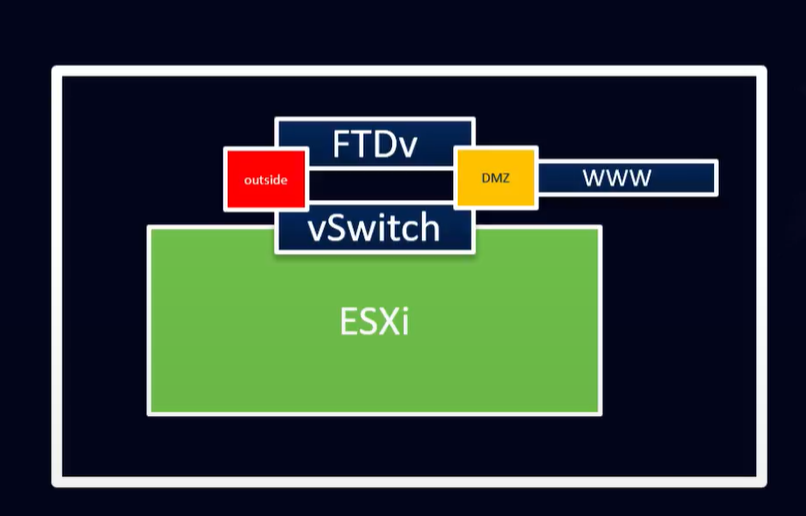
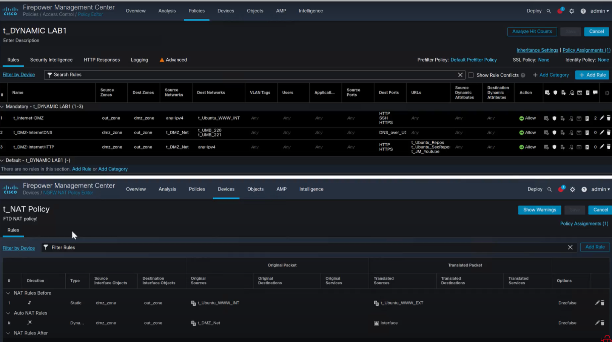
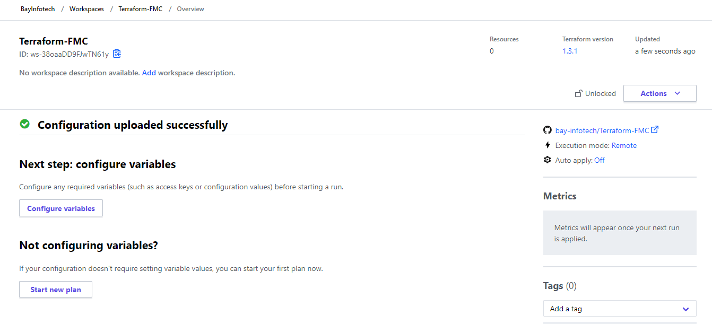
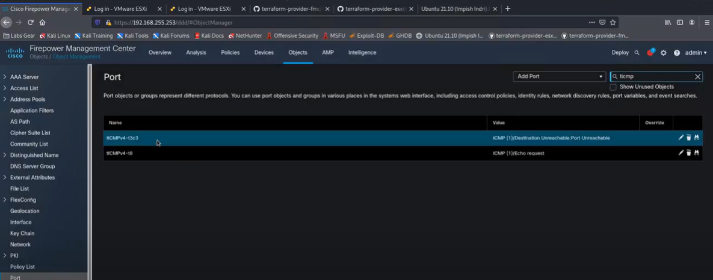
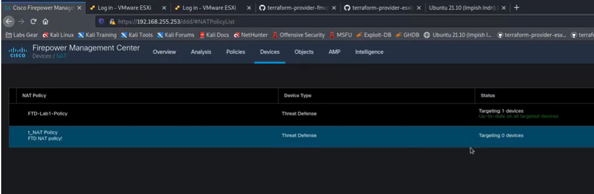

# Automate deployment Cisco FMC via Terraform

 This solution shows how to get started with automation of Cisco FMC via using Terrraform.

* Use Terraform to deploy Cisco FMC objects and all policies
* Use Terraform Business cloud to make it easier in the enterprise level

## Requirements

Here is a list of dependencies to make this work in your environment:

* Cisco FMC and FTD. we Used virtual FMC and Virtual FTD 
* Terraform Cloud Business (Recommended)
* vSphere 6.7 or higher
* Terraform v0.15.2 or higher
* A virtual machine template with CentOS or Ubuntu installed as the guest OS

## Credentials

We purposely did not add credentials and other sensitive information to the repo by including them in the `.gitignore` file. As such, if you clone this repo, you must create two files.

## Variables values required

Make sure the variable addressed in a terraform var files.

ariable "fmc_username" {
    type = string
    sensitive = true
}

variable "fmc_password" {
    type = string
    sensitive = true
}

variable "fmc_host" {
    type = string
}

variable "fmc_insecure_skip_verify" {
    type = bool
    default = false
}

Variable value can be addressed in the file or during plan.

## Overview of the network

we use simple architecture to show the power of IaC. this architecture can be expanded to more complex if needed. in this architecture we are representing a DMZ and simple web access.

## What Terraform Provisions

In this example, Terraform udeploy below objects:

* Create access policies
* Create access rules
* Create dynamic objecs
* Create manual nat rules
* Create FTD nat policies
* Create host objects
* Create protocol (ICMP) objects
* Create network group objects
* Create network objects
* Create port group objects
* Create security zones

## Creating and Applying the Terraform Plan

we used terraform Cloud business for the purpose of this practice. Create a new workspace and connect to github to add the Cisco-FSO-install-agent from github. Next step, all variable needs to be addressed if they are not addressed in variable files or variables set.

## Results

ICMP Object is created after applying the terraform

NAT Rules are created after applying the terraform 

## BayInfotech Repositories

Please visit our repositories for more detail and other projects in automation and programability:

[https://github.com/bay-infotech](https://github.com/bay-infotech)

## BayInfotech website

We are working hard to bring more automation and programmability into community. Please contact us for more detail projects and solutions

[https://bay-infotech.com](https://bay-infotech.com)
